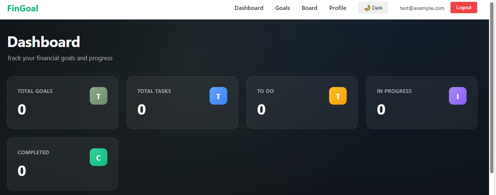
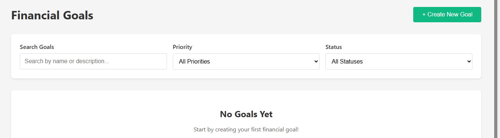
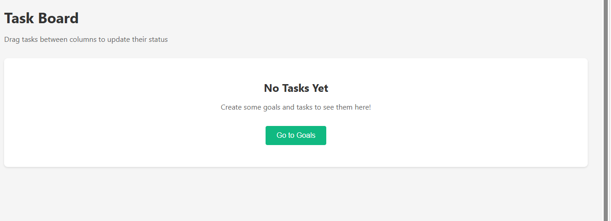
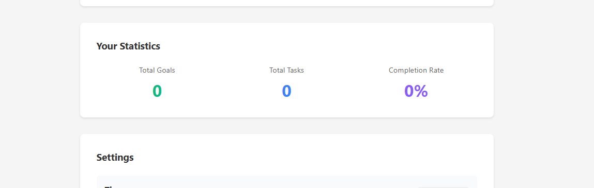

# 💰 FinGoal - Financial Goals Tracker

A modern, full-featured web application for tracking financial goals and breaking them down into actionable tasks. Built with React and designed with a professional fintech aesthetic.

🌐 [Live Demo]https://fin-goal-tracker.netlify.app/login

---

## 📸 Screenshots

### Dashboard
![Dashboard]


### Goals Management
![Goals Page]

### Kanban Board
![Kanban Board]


### Goal Details
![Goal Details]

---

## ✨ Features

### Core Functionality
-  User Authentication** - Secure login system with session persistence
-  Goal Management** - Full CRUD operations for financial goals
-  Task Management** - Break goals into actionable tasks
-  Drag-and-Drop Kanban** - Visual task organization (To Do, In Progress, Done)
-  Real-time Dashboard** - Live statistics and progress charts
-  Search & Filter** - Find goals quickly by name, priority, or status

### UI/UX Features
-  **Dark/Light Theme Toggle** - Persistent theme preference
-  **Interactive Charts** - Visual progress tracking with Recharts
-  **Toast Notifications** - Instant feedback for all actions
-  **Fully Responsive** - Works seamlessly on mobile, tablet, and desktop
-  **Smooth Animations** - Professional slide-in effects and transitions
-  **Glass-morphism Design** - Modern fintech-inspired UI

### Technical Features
- ⚡ **Lazy Loading** - Code-split routes for optimal performance
- 🔄 **Data Persistence** - All data saved to localStorage
-  **Error Boundaries** - Graceful error handling
-  **Protected Routes** - Secure navigation with authentication checks
-  **Optimized Build** - Production-ready deployment

---

## 🛠️ Tech Stack

### Frontend Framework
- **React 18** - Component-based UI library
- **React Router v6** - Client-side routing
- **Context API** - Global state management

### Libraries & Tools
- **Recharts** - Data visualization and charts
- **React Hot Toast** - Toast notifications
- **DnD Kit** - Drag-and-drop functionality
- **React Icons** - Icon library

### Development Tools
- **Create React App** - Project scaffolding
- **Git/GitHub** - Version control
- **Netlify** - Deployment and hosting

---

## Getting Started

### Prerequisites
- Node.js (v14 or higher)
- npm or yarn
- Git

### Installation

1. **Clone the repository**
```bash
git clone https://github.com/KANYINSOLA-OGUNBANJO/fin-goal-tracker.git
cd fin-goal-tracker
```

2. **Install dependencies**
```bash
npm install
```

3. **Start the development server**
```bash
npm start
```

4. **Open your browser**
Navigate to `http://localhost:3000`

### Build for Production
```bash
npm run build
```

This creates an optimized production build in the `build` folder.

---

## 📖 Usage Guide

### Getting Started
1. **Login** - Use any email and password (6+ characters) for demo
2. **Create a Goal** - Click "+ Create New Goal" and fill in details
3. **Add Tasks** - Click on a goal to add actionable tasks
4. **Track Progress** - Use the Kanban board to move tasks through stages
5. **View Dashboard** - Monitor all your goals and tasks in one place

### Key Features Walkthrough

#### Creating a Goal
- Navigate to "Goals" page
- Click "+ Create New Goal"
- Fill in: Name, Description, Target Amount, Current Amount, Target Date, Priority, Category
- Click "Create Goal"

#### Managing Tasks
- Click on a goal name to open details
- Click "+ Add Task" to create a new task
- Fill in task details and status
- Use "Done", "Edit", or "Delete" buttons to manage tasks

#### Using the Kanban Board
- Navigate to "Board" page
- Drag tasks between columns (To Do → In Progress → Done)
- Tasks automatically update their status

#### Search & Filter
- Use the search bar to find goals by name or description
- Filter by priority (High, Medium, Low)
- Filter by status (Active, Paused, Completed)

---

##  Design Philosophy

FinGoal features a **professional fintech-inspired design** with:
- **Dark Theme** - Easy on the eyes with sophisticated color palette
- **Sage Green Accents** - Calming, trust-building primary color
- **Glass-morphism Cards** - Modern frosted glass effects
- **Smooth Animations** - Slide-in transitions for enhanced UX
- **Clean Typography** - Professional hierarchy and readability

---

## 📁 Project Structure
```
fin-goal-tracker/
├── public/
├── src/
│   ├── components/
│   │   ├── board/          # Kanban board components
│   │   ├── common/         # Reusable components (Modal, Skeleton, ErrorBoundary)
│   │   ├── dashboard/      # Dashboard-specific components
│   │   ├── goals/          # Goal management components
│   │   ├── layout/         # Navbar and layout components
│   │   └── tasks/          # Task management components
│   ├── contexts/           # React Context providers (Auth, Theme)
│   ├── hooks/              # Custom hooks (useLocalStorage)
│   ├── pages/              # Page components (Dashboard, Goals, etc.)
│   ├── App.js              # Main app component with routing
│   ├── index.js            # React entry point
│   └── index.css           # Global styles and animations
├── netlify.toml            # Netlify deployment configuration
└── package.json            # Dependencies and scripts
```

---

## 🧪 Testing

The application has been thoroughly tested for:
- ✅ CRUD operations (Create, Read, Update, Delete)
- ✅ Authentication flow
- ✅ Drag-and-drop functionality
- ✅ Data persistence across sessions
- ✅ Responsive design on all screen sizes
- ✅ Theme persistence
- ✅ Search and filter accuracy
- ✅ Route protection and navigation

---

## Known Issues & Limitations

- **Mock Authentication** - Uses localStorage, not a real backend
- **No Data Sync** - Data is stored locally, not synced across devices
- **Browser Storage Limit** - Limited by localStorage capacity (~5-10MB)

---

## Future Enhancements

- [ ] Backend API integration with real authentication
- [ ] Data synchronization across devices
- [ ] Collaborative goals (share with family/friends)
- [ ] Budget tracking and expense categorization
- [ ] Email/SMS reminders for task deadlines
- [ ] Export data to CSV/PDF
- [ ] Integration with banking APIs
- [ ] Goal templates and suggestions
- [ ] Progress analytics and insights

---

## Author

**Kanyinsola Ogunbanjo**
- GitHub: [@KANYINSOLA-OGUNBANJO](https://github.com/KANYINSOLA-OGUNBANJO)
- LinkedIn:https://www.linkedin.com/in/ogunbanjo-kanyinsola-b16536b4/
- Portfolio:https://fin-goal-tracker.netlify.app/dashboard

---

## 📄 License

This project is open source and available under the [MIT License](LICENSE).

---

##  Acknowledgments

- **Frontend Engineering Fundamentals Course** - Week 5-6 Capstone Project
- **React Documentation** - Comprehensive guides and best practices
- **Netlify** - Seamless deployment platform
- **Open Source Community** - Amazing libraries and tools

---

## 📞 Support

For questions or issues, please:
1. Check the [Issues](https://github.com/KANYINSOLA-OGUNBANJO/fin-goal-tracker/issues) page
2. Create a new issue with detailed description
3. Contact:kanyinsolaogunbanjo@gmail.com
